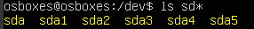
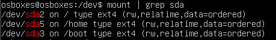
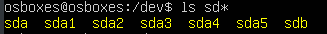
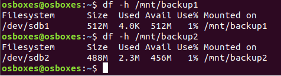

# ADMINISTRATION IT
## LAB 01 - LINUX BACKUP
_Authors : Nair Alic & Adam Zouari_

### TASK 1: PREPARE THE BACKUP DISK

1.Before plugging the disk in examine the special files in the /dev directory that represent hard disks. List all files called

- /dev/hd*
- /dev/sd*

Which disks and which partitions on these disks are visible?

**We can see 1 disk (sda) and 5 partitions (sda1/sda2/.../sda5) here.**

Which partitions are mounted? Use the command mount without parameters to find out.

**We can see that only sda2, sda3 and sda5 are mounted.**

2.Attach the disk to your computer.

Consult again the special files in /dev. Which new files appeared? These represent the disk and its partitions you just attached.

**We can see that a new file sdb appeared.**

3.Create a partition table on the disk and create two partitions of equal size using the parted tool.

You can consult Gentoo Linux Documentation -- Preparing the Disks as a reference on how to use parted.

- Using superuser privileges invoke parted with a single parameter which is the special file representing the disk. Be careful not to confuse the special file for the disk (ending in a letter) and for the partitions (ending in a number).

- Display the existing partitions with the print command. If the disk is completely blank you will get an error message about a missing disk label.

- Use the mktable command to create a partition table (overwriting any existing one). It should have Master Boot Record (MBR) layout (i.e. label type msdos).

- Display the free space with the command print free (roughly the size of the disk minus some overhead). Write the value down.

  **We have 1074 MB of size available**

- Use the mkpart command to create the partitions.

	- The first partition will
		- be a primary partition
		- have a file system type of fat32
		- start at 0
		- end at about half the free space.
		
	- The second partition will
		- be a primary partition
		- have a file system type of ext4
		- start at half the free space
		- end at the free space.
	
- Quit parted and verify that there are now two special files in /dev that correspond to the two partitions.

4.Format the two partitions using the mkfs command.

- The first partition should have the file system type vfat.
- The second partition should have the file system type ext4.

5.Create two empty directories in the /mnt directory as mount points, called backup1 and backup2. Mount the newly created file systems in these directories.

6.How much free space is available on these filesystems? Use the df command to find out. What does the -h option do?

**Here we can see that we have 512 MB for backup1 and 456 MB for backup2 folder. Option -h print the sizes in powers of 1024, which are more readable for us.**

