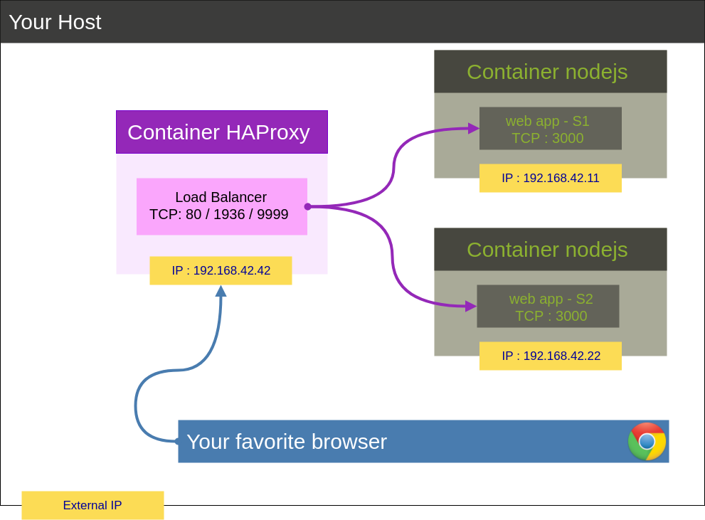

## Lab 04 - Docker
__Authors : Nair Alic & Adam Zouari__

# Table of contents

1. [Introduction](#intro)
2. [Tasks](#tasks)

	0 - [Identify issues and install the tools](#task-0)</br>
	1 - [Add a process supervisor to run several processes](#task-1)</br>
	2 - [Add a tool to manage membership in the web server cluster](#task-2)</br>
	3 - [React to membership changes](#task-3)</br>
	4 - [Use a template engine to easily generate configuration files](#task-4)</br>
	5 - [Generate a new load balancer configuration when membership changes](#task-5)</br>
	6 - [Make the load balancer automatically reload the new configuration](#task-6)</br>

3. [Difficulties](#difficulties)
4. [Conclusion](#conclusion)


* * *

**DISCLAIMER**: In this lab, we will go through one possible approach
to manage a scalable infrastructure where we can add and remove nodes
without having to rebuild the HAProxy image. This is not the only way
to achieve this goal. If you do some research you will find a lot of
tools and services to achieve the same kind of behavior.

## <a name="intro"></a>Introduction

# TODO

## <a name="tasks"></a>Tasks

### <a name="task-0"></a>Task 0: Identify issues and install the tools

#### Identify issues

In the previous lab, we built a simple distributed system with a load
balancer and two web applications. The architecture of our distributed
web application is shown in the following diagram:



The two web app containers stand for two web servers. They run a
NodeJS sample application that implements a simple REST API. Each
container exposes TCP port 3000 to receive HTTP requests.

The HAProxy load balancer is listening on TCP port 80 to receive HTTP
requests from users. These requests will be forwarded to and
load-balanced between the web app containers. Additionally it exposes
TCP ports 1936 and 9999 for the stats page and the command-line
interface.

For more details about the web application, take a look to the
[previous lab](https://github.com/SoftEng-HEIGVD/Teaching-HEIGVD-AIT-2015-Labo-02).

Now suppose you are working for a big e-tailer like Galaxus or
Zalando. Starting with Black Friday and throughout the holiday season
you see traffic to your web servers increase several times as
customers are looking for and buying presents. In January the traffic
drops back again to normal. You want to be able to add new servers as
the traffic from customers increases and you want to be able to remove
servers as the traffic goes back to normal.

Suppose further that there is an obscure bug in the web application
that the developers haven't been able to understand yet. It makes the
web servers crash unpredictably several times per week. When you
detect that a web server has crashed you kill its container and you
launch a new container.

Suppose further currently your web servers and your load balancer are
deployed like in the previous lab. What are the issues with this
architecture? Answer the following questions. The questions are
numbered from `M1` to `M6` to refer to them later in the lab. Please
give in your report the reference of the question you are answering.

1. <a name="M1"></a>**[M1]** Do you think we can use the current solution for a production environment? What are the main problems when deploying it in a production environment?

	**The current solution was to configure manually each node and rebuild the HAProxy image. That is impratical in production environment.**

2. <a name="M2"></a>**[M2]** Describe what you need to do to add new `webapp` container to the infrastructure. Give the exact steps of what you have to do without modifiying the way the things are done. Hint: You probably have to modify some configuration and script files in a Docker image.

	**1. Add webapp3 service  in `docker-compose.yml` :**
	```bash
	...
	webapp3:
       container_name: ${WEBAPP_3_NAME}
       build:
         context: ./webapp
         dockerfile: Dockerfile
       networks:
         public_net:
           ipv4_address: ${WEBAPP_3_IP}
       ports:
         - "4002:3000"
       environment:
            - TAG=${WEBAPP_3_NAME}
            - SERVER_IP=${WEBAPP_3_IP}
	...
	```
	
	**2. Add, in the `.env` file, the environment variables used in the docker-compose :**
	``` bash
	...
	WEBAPP_3_NAME=s3
	WEBAPP_3_IP=192.168.42.33
	...
	```
	**3. Add this line in `haproxy.cfg` :**
	
	`server s3 ${WEBAPP_3_IP}:3000 check cookie s3`
	
	**4. Finally down the docker-compose and re-build images :**
	```bash
	docker-compose down
	docker-compose up --build
	```
	
3. <a name="M3"></a>**[M3]** Based on your previous answers, you have detected some issues in the current solution. Now propose a better approach at a high level.

	**The main issue is that we have to modify some files manually and reboot the infrastructure. This may cause some errors. A better approach would be to detect dynamically the new nodes and update accordingly the config files.**

4. <a name="M4"></a>**[M4]** You probably noticed that the list of web application nodes is hardcoded in the load balancer configuration. How can we manage the web app nodes in a more dynamic fashion?

	**We can make our infrastructure more flexible and dynamically add and remove web servers. To achieve this goal, we have to use a tool that allows each node to know which other nodes exist at any given time.**

5. <a name="M5"></a>**[M5]** In the physical or virtual machines of a typical infrastructure we tend to have not only one main process (like the web server or the load balancer) running, but a few additional processes on the side to perform management tasks.

   For example to monitor the distributed system as a whole it is common to collect in one centralized place all the logs produced by the different machines. Therefore we need a process running on each  machine that will forward the logs to the central place. (We could also imagine a central tool that reaches out to each machine to gather the logs. That's a push vs. pull problem.) It is quite common to see a push mechanism used for this kind of task.

   Do you think our current solution is able to run additional management processes beside the main web server / load balancer process in a container? If no, what is missing / required to reach the goal? If yes, how to proceed to run for example a log forwarding process?
   
   **Actually our current solution isn't able to run additional management processes beside the main process because the Docker design limits one process per container. To reach the goal, we need to start a process supervisor which can run several processes.**

6. <a name="M6"></a>**[M6]** In our current solution, although the load balancer configuration is changing dynamically, it doesn't follow dynamically the configuration of our distributed system when web servers are added or removed. If we take a closer look at the `run.sh` script, we see two calls to `sed` which will replace two lines in the `haproxy.cfg` configuration file just before we start `haproxy`. You clearly see that the configuration file has two lines and the script will replace these two lines.

   What happens if we add more web server nodes? Do you think it is really dynamic? It's far away from being a dynamic configuration. Can you propose a solution to solve this?
   
   **In `run.sh`, we see that the `sed` calls replace two lines in the HAProy config before  starting, but if we want to add node after starting the lines will never be added to the configuration. It's not dynamic. A deamon could monitor the network, if a new node is detected it will modify the configuration of HAProxy.**

#### Install the tools

> In this part of the task you will set up Docker-compose with Docker containers like in the previous lab. The Docker images are a little bit different from the previous lab and we will work with these images during this lab.

**Deliverables**:

1. Take a screenshot of the stats page of HAProxy at <http://192.168.42.42:1936>. You should see your backend nodes.

	

2. Give the URL of your repository URL in the lab report.
	
	**You will find our repository here : https://github.com/AdamZouari/AIT_Labos/tree/master/labo4-docker/Teaching-HEIGVD-AIT-2019-Labo-Docker**


### <a name="task-1"></a>Task 1: Add a process supervisor to run several processes

> In this task, we will learn to install a process supervisor that will help us to solve the issue presented in the question [M5](#M5). Installing a process supervisor gives us the ability to run multiple processes at the same time in a Docker environment.

**Deliverables**:

1. Take a screenshot of the stats page of HAProxy at <http://192.168.42.42:1936>. You should see your backend nodes. It should be really similar to the screenshot of the previous task.
   
	

2. Describe your difficulties for this task and your understanding of what is happening during this task. Explain in your own words why are we installing a process supervisor. Do not hesitate to do more research and to find more articles on that topic to illustrate the problem.

	**In this task, we understand that we have modified our docker images to bypass the docker limitation in order to run multiple processes in our container. We didn't have any difficulties except an error when we changed the hash-bang. We modified `#!/bin/sh` by `#!/bin/with-contenv bash` instead of `#!/usr/bin/with-contenv bash` what caused this error at startup :**
	
	
	

### <a name="task-2"></a>Task 2: Add a tool to manage membership in the web server cluster

> Installing a cluster membership management tool will help us to solve the problem we detected in [M4](#M4). In fact, we will start to use what we put in place with the solution to issue [M5](#M5). We will build two images with our process supervisor running the cluster membership management tool `Serf`.

In this task, we will focus on how to make our infrastructure more
flexible so that we can dynamically add and remove web servers. To
achieve this goal, we will use a tool that allows each node to know
which other nodes exist at any given time.

**Deliverables**:

1. Provide the docker log output for each of the containers: `ha`, `s1` and `s2`. You need to create a folder `logs` in your repository to store the files separately from the lab report. For each lab task create a folder and name it using the task number. No need to create a folder when there are no logs.

   Example:

   ```
   |-- root folder
     |-- logs
       |-- task 1
       |-- task 3
       |-- ...
   ```
   
   **You will find the logs for this task [here.](https://github.com/AdamZouari/AIT_Labos/tree/master/labo4-docker/Teaching-HEIGVD-AIT-2019-Labo-Docker/logs/task2)**

2. Give the answer to the question about the existing problem with the current solution.
   
   **In our case there is no existing problem.. We've tried to start HAProxy first and after start s1. No error occurred neither in ha nor in s1. We can also ping s1 from ha.** 
   
   **HAProxy logs and ping :**
   
	

	**s1 logs :**
	
	

3. Give an explanation on how `Serf` is working. Read the official website to get more details about the `GOSSIP` protocol used in `Serf`. Try to find other solutions that can be used to solve similar situations where we need some auto-discovery mechanism.
   
   **According to [github repo](https://github.com/hashicorp/serf), Serf is a decentralized solution for service discovery and orchestration that is lightweight (it uses 5 to 10 MB of resident memory), highly available, and fault tolerant. Serf can notify the rest of the cluster if  a node failure is detected To communicate with other nodes, an efficient and lightweight gossip protocol is used. The Serf agents periodically exchange messages with each other. As an example, HashiCorp (the Serf developpers) made an analogy with a zombie apocalypse : *it starts with one zombie but soon infects everyone*. Consul, Zookeeper and etcd are the most popular alternatives and competitors to Serf.**


### <a name="task-3"></a>Task 3: React to membership changes

> Serf is really simple to use as it lets the user write their own shell scripts to react to the cluster events. In this task we will write the first bits and pieces of the handler scripts we need to build our solution.
  We will start by just logging members that join the cluster and the members that leave the cluster. We are preparing to solve concretely the issue discovered in [M4](#M4).

We reached a state where we have nearly all the pieces in place to make the infrastructure really dynamic. At the moment, we are missing the scripts that will react to the events reported by `Serf`, namely member `leave` or member `join`.

**Deliverables**:

1. Provide the docker log output for each of the containers:  `ha`, `s1` and `s2`.
   Put your logs in the `logs` directory you created in the previous task.
   
   **You will find the ha, s1 and s2 logs [here.](https://github.com/AdamZouari/AIT_Labos/tree/master/labo4-docker/Teaching-HEIGVD-AIT-2019-Labo-Docker/logs/task3)**

2. Provide the logs from the `ha` container gathered directly from the `/var/log/serf.log` file present in the container. Put the logs in the `logs` directory in your repo.

   **You will find the content of the `/var/log/serf.log` file [here.](https://github.com/AdamZouari/AIT_Labos/tree/master/labo4-docker/Teaching-HEIGVD-AIT-2019-Labo-Docker/logs/task3/serf.log)**


### <a name="task-4"></a>Task 4: Use a template engine to easily generate configuration files

> We have to generate a new configuration file for the load balancer each time a web server is added or removed. There are several ways to do this. Here we  choose to go the way of templates. In this task we will put in place a template engine and use it with a basic example. You will not become an expert in template engines but it will give you a taste of how to apply this technique which is often used in other contexts (like web templates, mail templates, ...).
  We will be able to solve the issue raised in [M6](#M6).

There are several ways to generate a configuration file from variables in a dynamic fashion. In this lab we decided to use `NodeJS` and `Handlebars` for the template engine.


**Deliverables**:

1. You probably noticed when we added `xz-utils`, we have to rebuild the whole image which took some time. What can we do to mitigate that? Take a look at the Docker documentation on [image layers](https://docs.docker.com/engine/userguide/storagedriver/imagesandcontainers/#images-and-layers).
   Tell us about the pros and cons to merge as much as possible of the command. In other words, compare:

  ```
  RUN command 1
  RUN command 2
  RUN command 3
  ```

  vs.

  ```
  RUN command 1 && command 2 && command 3
  ```

  There are also some articles about techniques to reduce the image size. Try to find them. They are talking about `squashing` or `flattening` images.
  
  **The RUN instruction will execute any commands in a new layer on top of the current image and commit the results. </br>
  On the one hand, decrease the number of RUN commands will decrease the number of layers and the image size. Moreover, multiple RUN commands can causes caching issues. For example :**
  ```bash
  FROM ubuntu:18.04
RUN apt-get update
RUN apt-get install -y curl
```
**Here the first RUN is done the first time but after it will be cached. Now if we want add a new package like node our image become :** 
```bash
  FROM ubuntu:18.04
RUN apt-get update
RUN apt-get install -y curl node
```
**So it won't update the repo sources and the packages version might be outdated.</br>
On the other hand, merge RUN commands will ignore the cache for each modification in the line. For example :**
```bash
  FROM ubuntu:18.04
RUN apt-get update && apt-get install -y curl && curl https://www.google.com
```
**If we just modify the curl command (now we want curl on heig-vd.ch) and re-build the image it will re-update the version of packages from the repo and re-install curl and finally do the curl.</br>
Both usages have pro and cons.</br>
docker-squash is a utility to squash multiple docker layers into one in order to create an image with fewer and smaller layers. It retains Dockerfile commands such as PORT, ENV, etc.. so that squashed images work the same as they were originally built. In addition, deleted files in later layers are actually purged from the image when squashed.**

2. Propose a different approach to architecture our images to be able to reuse as much as possible what we have done. Your proposition should also try to avoid as much as possible repetitions between your images.

	**In this lab, we have two images : the haproxy and the webapp. This two images have some commons things. In both of them we have installed Serf, S6 and Node (one by inheritance and one manually). This commons things could be combined in a `super-image` to avoid repetitions.**

3. Provide the `/tmp/haproxy.cfg` file generated in the `ha` container after each step.  Place the output into the `logs` folder like you already did for the Docker logs in the previous tasks. Three files are expected.
   
   In addition, provide a log file containing the output of the `docker ps` console and another file (per container) with `docker inspect <container>`. Four files are expected.
   
   **You will find the docker outputs and logs [here.](https://github.com/AdamZouari/AIT_Labos/tree/master/labo4-docker/Teaching-HEIGVD-AIT-2019-Labo-Docker/logs/task4)**
   
4. Based on the three output files you have collected, what can you say about the way we generate it? What is the problem if any?

	**TODO, pas compris**


### <a name="task-5"></a>Task 5: Generate a new load balancer configuration when membership changes

> We now have S6 and Serf ready in our HAProxy image. We have member
  join/leave handler scripts and we have the handlebars template
  engine. So we have all the pieces ready to generate the HAProxy
  configuration dynamically. We will update our handler scripts to
  manage the list of nodes and to generate the HAProxy configuration
  each time the cluster has a member leave/join event.  The work in
  this task will let us solve the problem mentioned in [M4](#M4).

Now, we need to refine our `join` and `leave` scripts to generate a proper HAProxy configuration file.

**Deliverables**:

1. Provide the file `/usr/local/etc/haproxy/haproxy.cfg` generated in the `ha` container after each step. Three files are expected.
   
   **You will find the docker outputs, list of files of `/nodes` folder and config files [here.](https://github.com/AdamZouari/AIT_Labos/tree/master/labo4-docker/Teaching-HEIGVD-AIT-2019-Labo-Docker/logs/task5/)**
   
   In addition, provide a log file containing the output of the 
   `docker ps` console and another file (per container) with
   `docker inspect <container>`. Four files are expected.

	**Idem.**
2. Provide the list of files from the `/nodes` folder inside the `ha` container.
   One file expected with the command output.
   
  	**Idem.**

3. Provide the configuration file after you stopped one container and the list of nodes present in the `/nodes` folder. One file expected with the command output. Two files are expected.
   
    In addition, provide a log file containing the output of the `docker ps` console. One file expected.

	**Idem.**

### <a name="task-6"></a>Task 6: Make the load balancer automatically reload the new configuration

> Finally, we have all the pieces in place to finish our
  solution. HAProxy will be reconfigured automatically when web app
  nodes are leaving/joining the cluster. We will solve the problems
  you have discussed in [M1 - 3](#M1).  Again, the solution built
  in this lab is only one example of tools and techniques we can use to
  solve this kind of situation. There are several other ways.

The only thing missing now is to make sure the configuration of HAProxy is up-to-date and taken into account by HAProxy.

We will try to make HAProxy reload his config with minimal
downtime. 

**Deliverables**:

1. Take a screenshots of the HAProxy stat page showing more than 2 web applications running. Additional screenshots are welcome to see a sequence of experimentations like shutting down a node and starting more nodes.
   
   Also provide the output of `docker ps` in a log file. At least one file is expected. You can provide one output per step of your experimentation according to your screenshots.
   
   **HAProxy stat page and `docker ps` output when :**
    - no backend are started : 
   
   	
   
   	[docker ps output](https://github.com/AdamZouari/AIT_Labos/tree/master/labo4-docker/Teaching-HEIGVD-AIT-2019-Labo-Docker/logs/task6/docker/docker-ps-step0)
	- 4 backend are started : 
   
   	
   
   	[docker ps output](https://github.com/AdamZouari/AIT_Labos/tree/master/labo4-docker/Teaching-HEIGVD-AIT-2019-Labo-Docker/logs/task6/docker/docker-ps-step1)
	
	- s1 and s2 are killed : 
   
   	
   
   	[docker ps output](https://github.com/AdamZouari/AIT_Labos/tree/master/labo4-docker/Teaching-HEIGVD-AIT-2019-Labo-Docker/logs/task6/docker/docker-ps-step2)
	
2. Give your own feelings about the final solution. Propose improvements or ways to do the things differently. If any, provide references to your readings for the improvements.

	**The final solution is pretty good in developpement but in production we could like to automatically add/remove nodes if the load increase/decrease.**
	
3. (Optional:) Present a live demo where you add and remove a backend container.
	
	**With pleasure if needed.**

## <a name="difficulties"></a> Difficulties

#TODO

## <a name="conclusion"></a> Conclusion

#TODO

